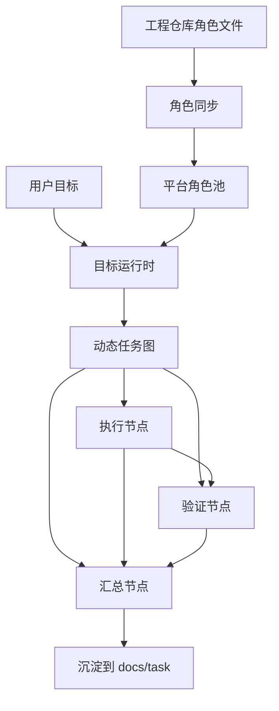

# dev-agent-harness

面向开发者的 agent harness。

它站在 `dev-roleplay-harness` 的基础上，把原本散落在 Claude Code、Codex、角色文件、任务文档和人工调度里的流程，收进一个可视化、可编排、可验证、可沉淀的任务系统。

## 核心判断

`dev-roleplay-harness` 解决的是一件关键问题：

**研发知识和角色协作不能只活在一次性会话里，它们应该进入工程仓库，成为可 review、可 diff、可复用的工程资产。**

但直接使用这套 harness 仍然有门槛。

开发者需要自己记住：

- 当前任务该用哪个角色
- 什么时候让 coder 做，什么时候让 evaluator 做
- 哪些角色定义在 `.claude/agents/`，哪些在 `roles/` 或 `agents/`
- Claude Code 和 Codex 分别适合跑哪类任务
- 子任务结果在哪里看
- 任务完成后哪些判断要沉淀回仓库

这些事情不应该一直靠人脑调度。

dev-agent-harness 的目标，是把这套角色协作方法变成一个面向开发者的运行系统：

> 用户只输入目标，系统读取工程角色，生成动态任务图，选择合适角色和运行时，追踪所有执行过程，并把关键知识沉淀回工程仓库。

## 什么时候用

适合：

- 你已经有或准备引入 `dev-roleplay-harness`
- 工程里有预定义角色，例如 coder、evaluator、code-reviewer、doc-refresher、dreamer
- 一个目标需要多阶段执行、独立验收、审查或知识沉淀
- 你希望 Claude Code、Codex 等不同运行时都能参与同一个目标
- 你希望看到每个子任务谁在跑、用什么运行时、输出了什么、是否通过验证

不适合：

- 一次性问答
- 单文件小修
- 不需要角色切分的小脚本
- 不关心验证和沉淀的临时任务

最后一种不需要 harness。直接开一个 agent 聊天更省事。

## 设计立场

### 1. 工程仓库是角色和知识的来源

角色不应该只存在于平台配置里。

在 harness 工程里，角色通常已经写在：

```text
.claude/agents/*.md
roles/*.md
agents/*.md
```

这些文件是工程知识的一部分，应该跟代码一起进入 Git。

dev-agent-harness 的做法是：

```text
project.local_directory
→ 扫描 .claude/agents / roles / agents
→ 同步成平台里的 Agent
→ 作为当前目标的可选角色池
→ 由目标运行时按任务需要选择角色
```

平台里的 Agent 是投影，不是唯一真相。

repo 里的角色文件才是可 review、可演进、可被其他工具接力的源头。

### 2. 目标驱动，而不是人肉挑 agent

原始 harness 的使用方式偏手工：

1. 打开 Claude Code 或 Codex
2. 判断当前任务该用哪个角色
3. 手动告诉模型该扮演 coder、evaluator 或 dreamer
4. 在不同工具之间切换上下文
5. 自己追踪每个阶段的结果

这套方式可用，但门槛高。

dev-agent-harness 把入口改成目标：

```text
用户目标
→ 选择关联工程
→ 同步工程角色
→ 目标运行时拆任务
→ 自动选择角色
→ 派发到 Claude Code / Codex 等运行时
→ 汇总结果
```

开发者不需要每次手动决定“现在该叫哪个 agent”。

系统应该根据目标、工程角色和任务阶段来选择。

### 3. 多运行时是同一目标里的执行资源

Claude Code、Codex 不是两套割裂工作流。

它们应该是同一个目标运行时里的不同执行资源。

一个目标里的不同节点可以由不同运行时执行：

```text
需求澄清       → Claude Code
代码实现       → Codex
端到端验证     → Claude Code + computer-use
代码审查       → Codex
文档沉淀       → 任意可写 repo 的 agent
```

关键不是“支持多少 CLI”，而是每个子任务都能明确看到：

- 使用哪个角色
- 使用哪个运行时
- 当前状态是什么
- 实时输出是什么
- 最终结果是什么

### 4. 动态工作流，不是固定模板

一个真实研发目标通常不是线性步骤。

目标运行时应该能动态决定：

- 哪些任务并行
- 哪些任务串行
- 哪些产物需要验证
- 哪些失败可以重试
- 哪些失败需要改写任务
- 哪些阶段需要沉淀文档

核心数据结构是目标任务图：

```text
goal_run
  └── goal_subtask[]
        ├── assignee agent
        ├── runtime
        ├── depends_on
        ├── kind: execute / verify
        ├── verdict
        └── result
```

后端不直接调用 LLM。

所有 AI 行为都表现为 task，由 daemon/runtime 认领并执行。

### 5. 子任务只接收任务合同

DAG 是系统内部控制结构。

执行者看到的应该是任务合同。

坏的 prompt：

```text
在 seq3 审查通过的前提下，把 seq1 与 seq2 的内容整合成文章。
```

好的 prompt：

```text
把下面两份已产出的材料整合成一篇文章；遵守审查结论中的约束，不引入与审查结论冲突的说法。
```

执行节点需要的是：

- 目标背景
- 当前任务
- 验收标准
- source material

它不应该被迫理解：

- `seq1`
- `seq2`
- 上游节点
- 下游节点
- “前两个节点”
- “第三步之后”

调度结构属于系统内部，任务合同属于执行者。

### 6. source material 替代文件中转

子任务之间传递数据，不能默认靠“去读上一步文件”。

文件可以是产物，但不应该成为隐式 handoff 协议。

当前设计是在派发任务时直接注入必要输入：

```text
Task inputs:

Task objective: 汇总成可读文章
The runtime has embedded the source material this task needs.

Source material:
### 核心机制说明
Result: ...

### 误解澄清
Result: ...

### 审查结论
Verdict: pass
Result: ...
```

这样页面上能直接看到每个子任务拿到了什么。

失败时也能判断：到底是输入不够，还是执行者做错。

### 7. 验证是工作流节点

执行者自报完成不够。

复杂研发任务需要独立验证节点：

- 复核产物是否满足任务合同
- 检查遗漏、边界和质量问题
- 输出 pass / reject
- reject 时触发返工

验证节点不是总结节点，它必须做判断。

下游节点消费的不只是“验证通过”，还必须拿到被验证过的原始产物。

否则汇总节点只知道“通过了”，却不知道“通过的是什么”。

### 8. 知识要沉淀回仓库

平台负责实时状态：

- 聊天流
- 调度态
- task 状态
- 实时消息

仓库负责长期知识：

- 目标
- 施工图
- 双契约
- 里程碑
- 关键判断
- memory

用户可以把一次目标任务持久化回工程：

```text
docs/task/{task-id}/
  ├── progress.md
  ├── plan/step-*.md
  └── memory/*.md
```

这是快照式沉淀，不做双向同步。

DB 是运行态真相，repo 是可接力的工程化投影。

### 9. 改造自己时，控制平面必须稳定

dev-agent-harness 可以 dogfood 自己，但不能让正在派发任务的实例成为被重启的目标。

正确拓扑是：

```text
stable control plane
→ 创建 candidate worktree
→ agent 修改 candidate worktree
→ 启动 candidate server / daemon / desktop
→ verify 节点验证 candidate 实例
→ 通过后再合并并显式重启控制平面
```

控制平面负责调度和观察；候选 worktree 负责被改、被测、被丢弃。

这不是流程洁癖，是自举系统的安全边界。

## 运转模型

```text
             工程仓库
   .claude/agents / roles / agents
                 │
                 ▼
          同步成平台角色池
                 │
                 ▼
用户目标 ─→ 目标运行时生成任务图 ─→ 按角色和运行时派发子任务
                 │                         │
                 │                         ▼
                 │                 Claude Code / Codex / ...
                 │                         │
                 ▼                         ▼
           状态树 + 实时输出        execute / verify / summary
                 │                         │
                 └────────── source material ──────────┐
                                                        ▼
                                            最终交付 + repo 文档沉淀
```



## 三个硬协议

### 角色同步协议

角色来源优先级：

1. `.claude/agents/*.md`
2. `roles/*.md`
3. `agents/*.md`

同步规则：

- 读 frontmatter 中的 name / description / color
- 正文可解引用完整角色说明
- 按 name 幂等创建或更新 Agent
- repo → 平台单向同步
- 平台 Agent 不自动回写 repo

这样既能接入 Claude Code 的角色格式，也能接入普通 harness 的散文角色文件。

### 任务合同协议

子任务 prompt 禁止暴露 workflow topology。

禁止把这些写进执行合同：

- `seq1`
- `seq2`
- node number
- upstream / downstream node
- previous / next node

应该写成语义化输入：

- API contract
- 审查结论
- 页面验证证据
- 已产出的核心材料
- 端到端运行结果

### 仓库沉淀协议

沉淀不是把所有聊天倒进 repo。

只沉淀会改变未来判断的内容：

- 目标和范围
- 施工图
- 双契约
- 被否决方案
- 验证经验
- 踩坑和修正

聊天流、实时调度和临时状态留在平台。

## 端到端验证

开发者 agent harness 不能只验证代码静态正确。

很多真实任务的终点是：

- 桌面端页面真的可用
- 浏览器交互真的跑通
- 本地 daemon 真的认领任务
- Claude Code / Codex 子进程真的拿到正确 prompt
- task message 真的实时出现在 UI

所以端到端验证要工具化：

- 启动 server
- 启动 daemon
- 启动桌面端
- 操作页面或客户端
- 抓截图、AX 树、日志
- 用机制测试锁住状态机

这里继承了 computer-use-harness 的判断：

> 端到端验证应该是 agent 可调用的动作，而不是人肉确认。

## 当前关键能力

- 从工程 repo 同步角色到平台 Agent
- 通过目标创建动态任务图
- 由模型根据目标和角色池选择执行角色
- 子任务可运行在不同 runtime，例如 Claude Code / Codex
- 状态树和实时输出展示每个任务的执行过程
- verify 节点支持 pass / reject 和返工
- 下游任务通过 source material 拿到真实上游产物
- summary 节点生成最终交付
- goal_persist 将任务资料按 harness 结构沉淀回 repo
- self-dogfooding 时用独立候选 worktree 隔离控制平面

## 代码入口

- `server/internal/service/goal.go`：目标任务状态机、DAG 调度、verify、summary、persist、decision
- `server/internal/daemon/prompt.go`：规划、执行、验证、汇总、持久化 prompt
- `server/internal/service/role_sync.go`：工程角色同步
- `packages/views/tasks/`：任务页、状态树、实时输出、成员/角色选择
- `docs/step-multi-agent-orchestration/`：多智能体编排经验
- `docs/step-project-role-sync/`：工程角色同步经验
- `docs/step-repo-docs-persistence/`：任务沉淀到仓库经验
- `docs/step-e2e-testing/`：端到端验证经验
- `docs/step-self-dogfooding/`：用当前 harness 改造当前工程的隔离流程
- `scripts/create-dogfood-worktree.sh`：创建候选 worktree 和 `.env.worktree`
- `.agents/skills/dev-agent-harness-self-dogfooding/` / `make agent-skills`：模型可发现的自举改造 Skill

## 一句话

dev-agent-harness 不是要重新发明 `dev-roleplay-harness`。

它要做的是：

> 把 role-play harness 变成一个开发者可以低门槛使用的、多运行时、多角色、可视化、可验证、可沉淀的 agent harness。
